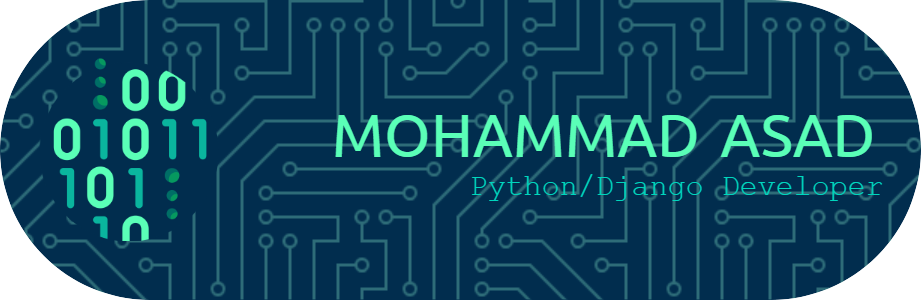

  <h1 align="center">Hi, I'm Mohammad Asad 👋🏻 👨🏻‍💻</h1>
  <h3 align="center">Python/Django Developer | Backend Engineer | AI/ML Enthusiast</h3>

  <!--

    
  
-->

  

    
  

---

Welcome to my GitHub! I'm a dedicated Python/Django developer passionate about backend development, AI/ML, and solving real-world problems with clean, scalable code.

---

## 🔧 Technologies & Tools

- **Languages**: Python, C, JavaScript  
- **Backend**: Django, Django REST Framework, FastAPI, Redis, WebSockets, JWT  
- **Frontend**: HTML, CSS, JavaScript  
- **Databases**: MySQL, PostgreSQL, DBMS  
- **AI/ML**: Pandas, NumPy, Scikit-learn, Streamlit, Tableau  
- **DevOps & Cloud**: Docker, Vercel  
- **Testing**: Pytest, Postman  
- **Code Quality**: SonarQube, Clean Code Practices  
- **Version Control**: Git, GitHub, Gitea  
- **Other Tools**: VS Code, SpeechRecognition, Tkinter, PyQt, Slack API

---

## 🌱 Currently Exploring

- Microservices using Django + FastAPI  
- Kafka and Redis for real-time architecture  
- CI/CD pipelines and system design patterns

---

## 🤝 Open to Collaborate On

- Open-source Django or AI/ML projects  
- Real-time dashboards or geolocation-based systems  
- Automation tools and backend APIs

---

## 📫 Connect With Me

- ✉ [mohdasad.9506@gmail.com](mailto:mohdasad.9506@gmail.com)  
- 🌐 [Portfolio](https://asadfolio.vercel.app)  
- 💼 [LinkedIn](https://linkedin.com/in/mohammad-asad-631647277)  
- 💻 [GitHub](https://github.com/mohdasad05)  
- ▶️ [YouTube](https://youtube.com/@mohdasad_05)

---

## 🚀 Highlight Projects

- **🦺 WeSalvator – Animal Rescue Platform**  
  Django + WebSockets-based platform to assign and track rescue tasks in real-time with JWT auth, Redis, Channels.

  **🛒 Buyer-Seller Ecommerce**  
  Full-featured backend for a role-based e-commerce system using Django REST Framework, MySQL, and JWT authentication with product management, search, and buyer-side ordering.

- **🎬 Movie Recommendation System**  
  A Streamlit app recommending movies using cosine similarity and TMDB metadata.

- **🌸 Iris Classification**  
  Machine learning project using Scikit-learn to classify Iris flower species based on input features with interactive results.

- **🖼️ Image Classification**  
  A CNN-based image classifier using TensorFlow/Keras for recognizing categories of images with high accuracy.

- **🔢 Handwritten Digit Recognition**  
  CNN-based classifier for MNIST dataset using TensorFlow/Keras.

- **🧠 Voice Assistant**  
  Command-line voice assistant built using SpeechRecognition and Python automation.

- **🛡️ Slack Task Bot | Password Generator | GUI Tools**  
  Automation tools showcasing API integration, GUI with Tkinter, and productivity utilities.

---

## 📊 GitHub Stats

  

  

  

---

> 🧩 *"Turning logic into code and ideas into impactful solutions."*
